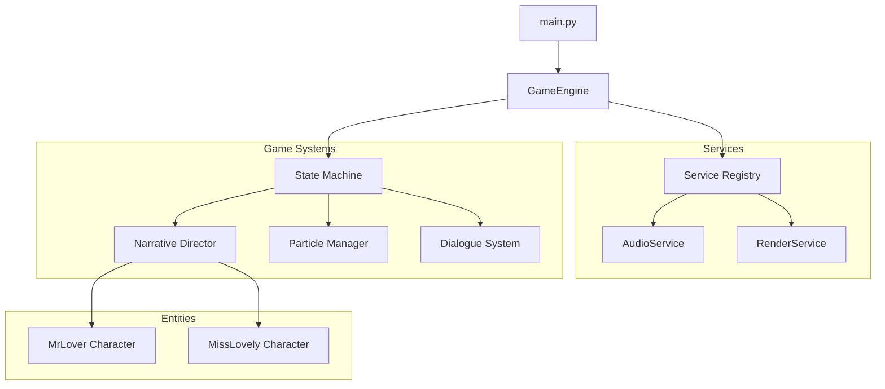
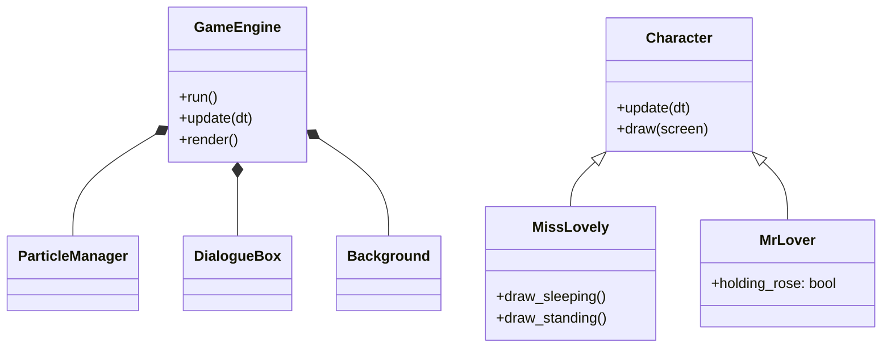

<div align="center">

# 🌹 Rose Day Special: Wishing Game 🌹

[](https://www.python.org/downloads/)
[](https://opensource.org/licenses/MIT)
[-red>)](https://github.com/AhmadHassan-BTed)
[](CONTRIBUTING.md)

**A high-fidelity, story-driven pixel art experience crafted for the spirit of Rose Day.**
_Designed by Ahmad Hassan (B-Ted)_

[Features](#-features) • [Quick Start](#-quick-start) • [Architecture](#-architecture) • [Contributing](#-contributing)

</div>

---

### 💝 A Gift for Your Loved One
This game was crafted as a heartfelt way to express your love. Use it to wish your special someone a Happy Rose Day, customize it with your private memories, and let the pixel-art magic do the rest. It's not just a game; it's a personalized wish wrapped in code.

---

The **Rose Day Wishing Game** is more than just a project; it's a digital rose garden where code meets emotion. Crafted with love and a focus on high-fidelity storytelling, this interactive experience brings the magic of Rose Day to your screen. 

Built on a professional, service-oriented architecture, it seamlessly blends engineering maturity with a heartwarming narrative of two souls, **MrLover** and **MissLovely**, as they journey through a day of dreams, napping, and heartfelt surprises.

> *"Like a rose, a project is beautiful not just in its bloom, but in the care put into its roots."*

This project was built to demonstrate clean engineering practices in game development while providing a meaningful, personalized gift experience.

---

## ✨ Features

- **Heartfelt Narrative**: A multi-stage state machine that guides **MrLover** and **MissLovely** through their special day.
- **Dreamy Environments**: Hand-crafted pixel-art backgrounds that shift from the warmth of the sun to the mystery of the evening and the sparkles of a dream.
- **Dancing Particles**: A high-performance physics engine that fills the air with drifting snow, floating hearts, and delicate rose petals.
- **Soulful Soundscapes**: Integrated audio services for a continuous, immersive musical journey.
- **Your Own Story**: Fully customizable names, greetings, and secrets tucked away in the environment configuration.

---

## 🏗️ Architecture

The repository follows a modern decoupled structure, ensuring 100% cohesion and minimal coupling between systems.

### System Workflow



### Internal Module Structure



---

## 📂 Repository Structure

```text
Rose-Day-Wishing-Game/
├── src/
│   ├── core/           # Dependency injection and event bus
│   ├── engine/         # Main game loop and state management
│   ├── entities/       # Character logic and pixel-art rendering
│   ├── services/       # Decoupled Audio and Rendering services
│   ├── ui/             # Backgrounds and dialogue overlays
│   ├── utils/          # Particle systems and constants
│   ├── config/         # Environment-based configuration
│   └── main.py         # Application entry point
├── docs/               # Technical specifications
├── .env.example        # Configuration template
├── pyproject.toml      # Build system and metadata
└── requirements.txt    # Project dependencies
```

---

## 🚀 Quick Start

### 1. Prerequisites

- Python 3.12 or higher
- `pip` package manager

### 2. Installation

```powershell
# Clone the repository
git clone https://github.com/AhmadHassan-BTed/Rose-Day-Wishing-Game.git
cd Rose-Day-Wishing-Game

# Install dependencies
pip install -r requirements.txt
```

### 3. Configuration

The game is pre-configured with generic values in the `.env` file. You can modify these values to personalize the experience:

```powershell
# Open .env and change names/messages
# Example: PLAYER_NAME="Your Name"
```

### 4. Launch & Wish

```powershell
python src/main.py
```
*Run the game and share the screen with your loved one to wish them in style!*

---

## 🛠️ Data Flow & Lifecycle

1. **Initialization**: The `GameEngine` initializes services and registers them in the central `Registry`.
2. **Configuration**: Settings are loaded from `.env` and validated via the `config` module.
3. **Execution Loop**:
    - **Handle Input**: Events are captured via `pygame`.
    - **Update**: Systems update based on Delta Time (`dt`) for frame-independent movement.
    - **Render**: The `RenderService` composites the background, entities, and UI.
4. **Shutdown**: Clean termination of the Pygame mixer and display.

---

## 🤝 Contributing

Contributions that improve architecture, performance, or narrative depth are welcomed.

1. Fork the repository.
2. Create a feature branch.
3. Submit a pull request with a detailed description of changes.

---

## 🛡️ License & Credits

- **Author**: Ahmad Hassan (B-Ted)
- **License**: [MIT License](LICENSE)
- **Acknowledgments**: Built with the incredible [Pygame](https://www.pygame.org/) community.

<div align="center">
    <h3>Every rose has a story. This one is yours.</h3>
    <i>Designed for the one who makes your world bloom. On this special Rose Day. 🌹</i>
</div>
