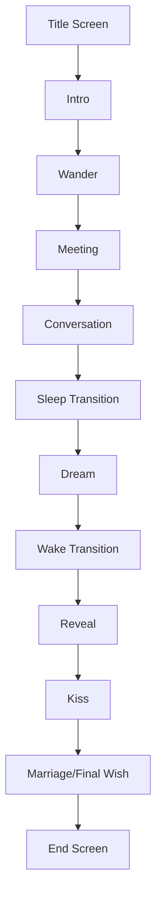

# Architecture Overview

This document describes the high-level architecture of the Rose Day Wishing Game.

## Design Philosophy

The project is designed with the following principles:
- **Modularity**: Logic is split into specialized modules to improve maintainability.
- **Data-Driven**: Messages and names are loaded from configuration rather than being hardcoded.
- **Separation of Concerns**: Rendering logic is separated from game state logic where possible.

## Component Breakdown

### 1. Game Engine (`src/engine/game.py`)
The central hub of the application. It initializes Pygame, manages the main loop, and coordinates updates between all systems.

### 2. State Management
The game uses a state machine to transition between different narrative phases:
- `TITLE`: Main menu.
- `INTRO`: Opening sequence.
- `WANDER`: Interactive walking phase.
- `CONVERSATION`: Dialogue between characters.
- `DREAM`: Surreal transition sequence.
- `REVEAL`: The climax of the wish.
- `END`: Final message display.

### 3. Entity System (`src/entities/`)
Characters are represented by classes inheriting from a base `Character` class. Each entity handles its own animation state and drawing logic.

### 4. UI System (`src/ui/`)
- **Background**: Handles procedurally generated surfaces for different times of day.
- **DialogueBox**: Manages text wrapping and rendering for conversations.

### 5. Utility System (`src/utils/`)
- **ParticleManager**: A robust system for spawning and updating diverse particle types (snow, petals, hearts).
- **Constants**: Shared enums and fixed values.

## Narrative Flow

